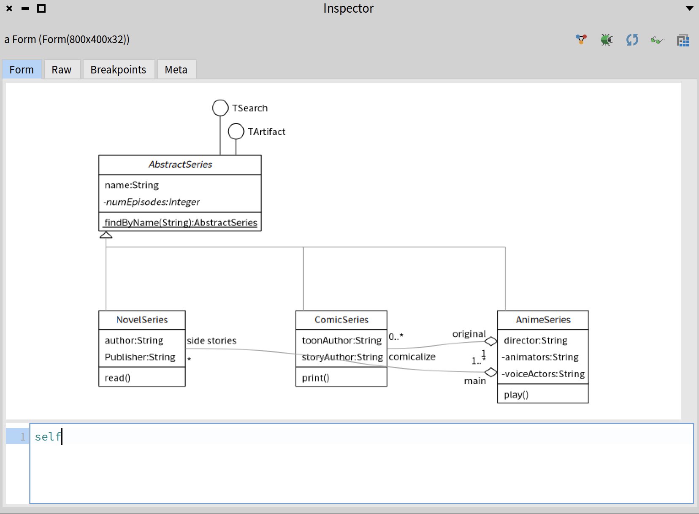

# MicroUML: A UML model and an embedded DSL in Pharo.

MicroUML offers a small Pharo embedded syntax to describe class diagrams. 

## Needs

Often we would like to describe simple class diagram in emails, discord or other textual channels.
But we do not want to have load a specific parser infrastructure to be able to manipulate it. 

## Design 
MicroUML has been designed during ESUG 2025 at Gdansk with the following constraints

- only use the Pharo syntax
- be compact
- covers most of the UML class diagram
- supports simple relation
- produces a minimal metamodel objects


### Building and Visualizing

To build a MicroUML diagram, we can use a special class called `MicroUMLAstBuilder` or its alias `MU`. This class understands a message `===` which can be used to define classes. Take a look at the following example. We will explain all elements in the following sections.

```st
uml := MicroUMLAstBuilder
===
#AbstractSeries % #abstract
    --@ #TSearch
    --@ #TArtifact
    - #name @ String 
    - #numEpisodes @ Integer % #abstract % #private
    |> #findByName ~#(String) @ #AbstractSeries
=== 
#NovelSeries 
    --|> #AbstractSeries
    - #author @ String 
    - #Publisher @ String 
    > #read~{}
=== 
#ComicSeries 
    --|> #AbstractSeries 
    - #toonAuthor @ String
    - #storyAuthor @ String 
    > #print~{} 
=== 
#AnimeSeries
    --|> #AbstractSeries 
    - #director @ String 
    - #animators @ String % #private
    - #voiceActors @ String % #private
    > #play~{} 
    <>-- #ComicSeries @ ('original' -> 'comicalize') %< '1' %> '0..*'
    <>-- #NovelSeries @ ('main' ->'side stories') %< '1..*' %> '*'.
```

Each `===` followed by a symbol `#ClassName` defines a class. The result is an object of class `MicroUMLAstBuilder`. We can use a `diagram` message to build an actual AST of our UML diagram:

```st
uml diagram
```


We can also visualize this diagram directly using the `extent:` message. It requires a point as an argument, specifying the `width @ height` of the image.

```
uml extent: 800@400
```




### Syntax

#### Class definition
Class definition starts with `#` and conceptually produces a UmlClassBox. Classes can be defined by sending `===` to `MicroUMLAstBuilder` or `MU`:

```st
MU
===
#AbstractSeries 
```

They can also be defined by sending any of the association messages to a Symbol. In the example below, we define a class `AbstractSeries` by specifying that it is a subclass of `Manga`:

```st
#AbstractSeries
    --|> #Manga
```

You can read more about different associations in th following sections.

#### Members

MicroUML supports two types of members for class diagrams: attributes and methods. Attributes are defined with `-` message with a symbol defining the attribute name. For example:

```st
#Class --|> #Subclass
    - #var1
    - #var2
```

Methods can be defined in a similar way using the `>` message:

```st
#Class --|> #Subclass
    > #method1
    > #method2
```

We can add arguments to a method with a `~` message followed by the collection of argument types:

```st
#OrderedCollection --|> #Collection
	> #do: ~ { #Block }
	> #copyFrom:to: ~ { #Integer . #Integer }
```

The type of attributes and the return type of methods can be specified with a `@` message:

```st
#Class --|> #Superclass
    - #var1 @ #Integer
    - #var2 @ #String
    > #method1 @ #Float
    > #method2 ~ { #Integer } @ #Integer
```

By default, attributes are protected (accessible from the class that defines it and from the superclasses) and methods are public. We can use the `%` message to change the access modifiers:

```st
#Class --|> #Superclass

    - #var1 "protected by default"
    - #var2 % #public
    - #var3 % #private
    - #var4 % #protected

    > #method1 "public by default"
    > #method2 % #public
    > #method3 % #private
    > #method4 % #protected
```

Access modifiers can be combined with types and argument lists in any order:

```st
#Class --|> #Superclass
    - #var1 @ #Integer % #public
    - #var2 % #public @ #Integer
    > #method1 ~ { #String } % #private @ #String
```

To define class attributes or class methods, add `|` before the definition. In other words, class attributes are defined using the `|-` message and class methods using the `|>` message:

```st
#Class --|> #Subclass
    |- #var1
    |- #var2 @ #String % #public
    |> #method1
    |> #method2 ~ { #Integer } @ #String
```

#### Relations

```st
"Inheritance"
#Circle
  --|> #Shape.

"Plain association with one role (left only)"
#Employee
  -- #Company
    @ #employer. "left role = employer"

"Plain association with both roles + multiplicities"
#Team
  -- #Player
    @ (#team -> #members)
    %< '1';
    %> '0..*'.

"Directed association (right) with right-only role"
#Order
  => #Customer
    @ (#none -> #orders) "explicit right role"
    %< '0..*'
    %> '1'.

"Aggregation (undirected) with qualifier on the right end"
#Library
  <>-- #Book
    @ (#library -> #holdings)
    %< '1'
    %> '0..*'.

"Composition (right) with association class"
#Car
  *=> #Wheel
   @ (#car -> #wheels)
    %< '1'
    %> '4'
    @= #Mounting.

"Dependency"
#Client
  --> #Service
    @ 'uses at runtime'.
```

#### Class sequences

We use `===` to link multiple class definitions. 

```st
MU
===
#AbstractSeries 
    - #name @ #String 
    - #numEpisodes @ #Integer
=== 
#NovelSeries 
    --|> #AbstractSeries
    - #author @ #String 
    - #publisher @ #String 
    > #read
```

### Considerations 
We decided to avoid to manipulate classes as the receiver in the class definition (`Object << #Point` and not `#Object << #Point`)
This is why we extensively use Symbols. This gives regularity and writers do not have to know if the classes they refer exist or not. 


## Loading
Watch out we want to integrate it into Pharo so the repository will probably change.


```st
Metacello new
  baseline: 'MicroUML';
  repository: 'github://olekscode/MicroUML:main';
  load.
```

## If you want to depend on it

```st
  spec 
    baseline: 'MicroUML' 
    with: [ spec repository: 'github://olekscode/MicroUML:main' ].
```


## Authors

S. Ducasse, T. Oda, O. Zaitsev
