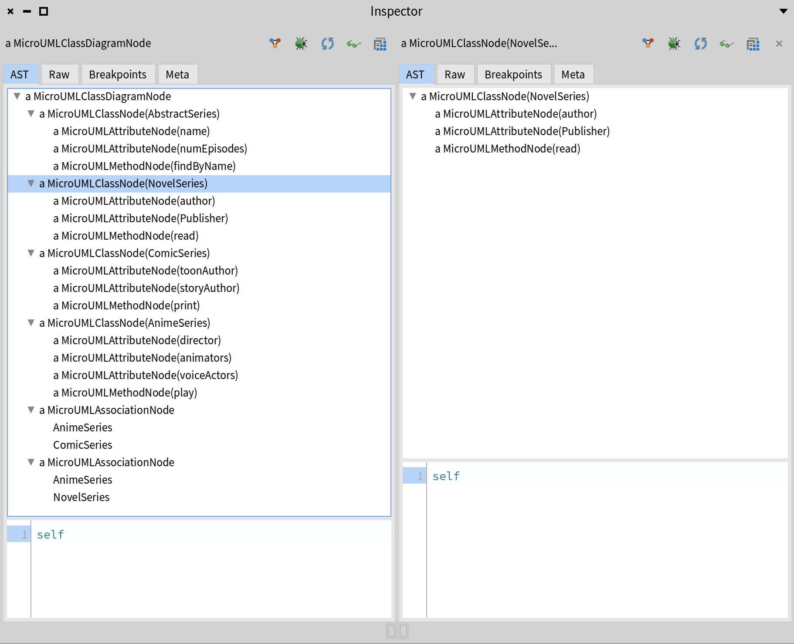
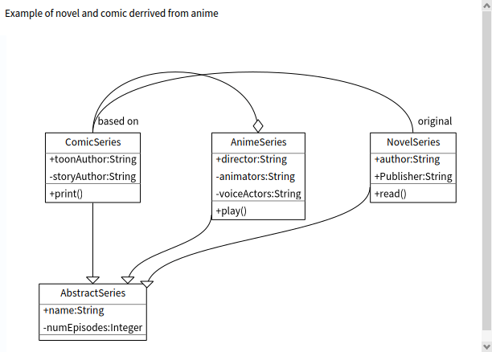

# MicroUML: A UML model and an embedded DSL in Pharo.

MicroUML offers a small Pharo embedded syntax to describe class diagrams. 

## Needs

Often we would like to describe simple class diagram in emails, discord or other textual channels.
But we do not want to have load a specific parser infrastructure to be able to manipulate it. 

## Design 
MicroUML has been designed during ESUG 2025 at Gdansk with the following constraints

- only use the Pharo syntax
- be compact
- covers most of the UML class diagram
- supports simple relation
- produces a minimal metamodel objects

### Syntax

#### MicroUMLAstBuilder or MU

To define a MicroUML diagram, we can use a special class called `MicroUMLAstBuilder` or its alias `MU`. This class understands a message `===` which can be used to define classes. Take a look at the following example. We will explain all elements in the following sections.

```st
uml := MicroUMLAstBuilder
===
#AbstractSeries % #abstract
    --@ #TSearch
    --@ #TArtifact
    - #name @ String 
    - #numEpisodes @ Integer % #abstract % #private
    |> #findByName ~#(String) @ #AbstractSeries
=== 
#NovelSeries 
    --|> #AbstractSeries
    - #author @ String 
    - #Publisher @ String 
    > #read~{}
=== 
#ComicSeries 
    --|> #AbstractSeries 
    - #toonAuthor @ String
    - #storyAuthor @ String 
    > #print~{} 
=== 
#AnimeSeries
    --|> #AbstractSeries 
    - #director @ String 
    - #animators @ String % #private
    - #voiceActors @ String % #private
    > #play~{} 
    <>-- #ComicSeries @ ('original' -> 'comicalize') %< '1' %> '0..*'
    <>-- #NovelSeries @ ('main' ->'side stories') %< '1..*' %> '*'.
```

Each `===` followed by a symbol `#ClassName` defines a class. The result is an object of class `MicroUMLAstBuilder`. We can use a `diagram` message to build an actual AST of our UML diagram:

```st
uml diagram.
```




#### Class definition
Class definition starts with `#` and conceptually produces a UmlClassBox

```st
#AbstractSeries 
```

```st
#AbstractSeries
    --|> #Manga
```

#### Members

The message `-`, `+`, `*` are used to add members to a UmlClassBox

```st
#AbstractSeries
    - #read~{}
    >+ #printOn:~{s @Stream}
```

#### Class variable and class methods

```st
#AbstractSeries
    $ ClassVar @ #Float
    >+ #(static) % #findByName ~ {#String} @ #AbstractSeries
```

#### Relations

- ` --|> ` defines subclass
- ` ---<'comicalize'> ` composition

```st
#AnimeSeries
    --|> #AbstractSeries 
    <'original'>---<'comicalize'> #ComicSeries 
    <><'main'>---<'side stories'> #NovelSeries 
```

#### Class sequences

We use `===` to link multiple class definitions. 

```st
#AbstractSeries 
    + #name @ String 
    * #numEpisodes @ Integer
=== 
#NovelSeries 
    --|> #AbstractSeries
    + #author @ String 
    + #Publisher @ String 
    >+ #read~{}
```

### Considerations 
We decided to avoid to manipulate classes as the receiver in the class definition (`Object << #Point` and not `#Object << #Point`)
This is why we extensively use Symbols. This gives regularity and writers do not have to know if the classes they refer exist or not. 


## Example

The following UML diagram is produced by executing (and not having a dedicated parser) 
the following Pharo code snippet.





Here is the Pharo program that creates a metamodel that can be rendered as the previous figure.

```st
#AbstractSeries 
    + #name @ String 
    * #numEpisodes @ Integer
=== 
#NovelSeries 
    --|> #AbstractSeries
    + #author @ String 
    + #Publisher @ String 
    >+ #read~{}
=== 
#ComicSeries 
    --|> #AbstractSeries 
    + #toonAuthor @ String
    * #storyAuthor @ String
    >+ #print~{}
=== 
#AnimeSeries
    --|> #AbstractSeries 
    + #director @ String 
    * #animators @ String
    * #voiceActors @ String
    >+ #play~{} <>---<'based on'> #ComicSeries
=== 
#ComicSeries ---<'original'> #NovelSeries 

    extent: 600 @ 400
```


```st
| uml builder |
uml := 
#(abstract) % #AbstractSeries 
    + #name @ String 
    - #(abstract) % #numEpisodes @ Integer
    >+ #(static) % #findByName ~ {#String} @ #AbstractSeries
=== 
#NovelSeries 
    --|> #AbstractSeries
    + #author @ String 
    * #Publisher @ String 
    >+ #read~{}
=== 
#ComicSeries 
    --|> #AbstractSeries 
    + #toonAuthor @ String
    * #storyAuthor @ String 
    >+ #print~{} 
=== 
#AnimeSeries
    --|> #AbstractSeries 
    + #director @ String 
    - #animators @ String
    - #voiceActors @ String 
    >+ #play~{} 
    <'original'>---<'comicalize'> #ComicSeries 
    <><'main'>---<'side stories'> #NovelSeries .
    builder := MicroUMLRoassalBuilder new
                   classDiagramNode: uml diagram;
                   build.
    builder
        @ RSCanvasController;
        open
```


## Loading
Watch out we want to integrate it into Pharo so the repository will probably change.


```st
Metacello new
  baseline: 'MicroUML';
  repository: 'github://olekscode/MicroUML:main';
  load.
```

## If you want to depend on it

```st
  spec 
    baseline: 'MicroUML' 
    with: [ spec repository: 'github://olekscode/MicroUML:main' ].
```


## Authors

S. Ducasse, T. Oda, O. Zaitsev
